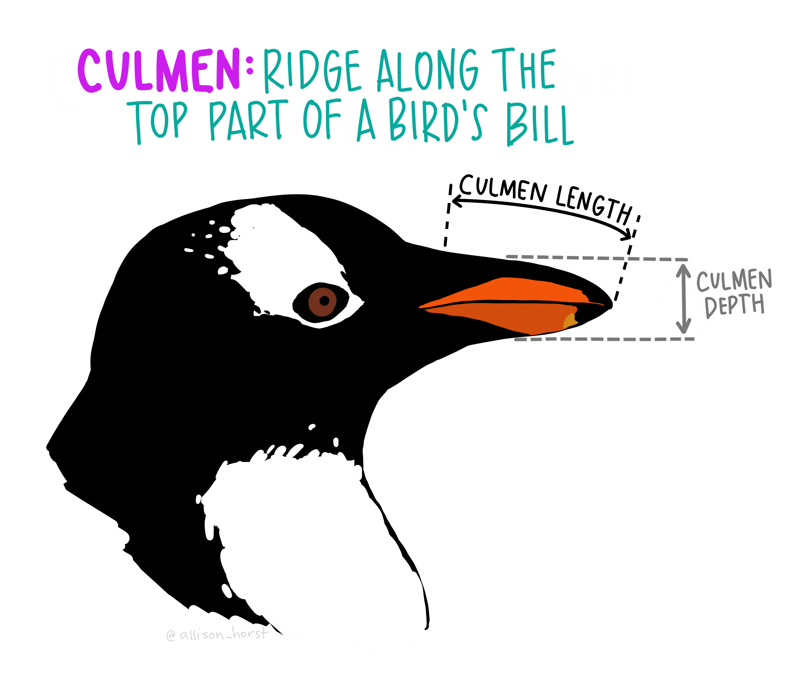
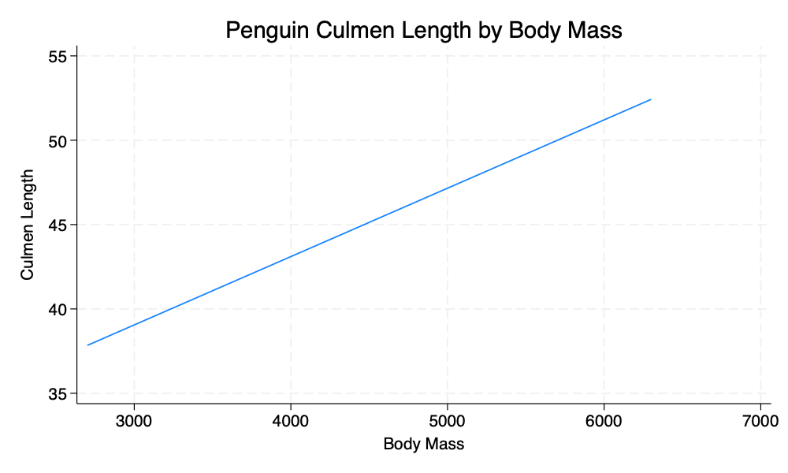

% Data Visualization With Stata (The Basics)
% Andy Grogan-Kaylor
% {{.1}}

---
geometry: margin=.5in
---

# Introduction 

99% of data visualization work seems to consist of creating bar graphs (`graph bar y, over(x)`) and scatterplots (`twoway scatter y x`). (For the sake of completeness, I am also going to mention histograms (`histogram x`).)  

This is a quick guide to these ideas using the [Palmer Penguins Data](https://github.com/allisonhorst/palmerpenguins/blob/master/README.md).

{width=20%}  {width=20%}

{{2}}

I am not a particular fan of Stata's default graph schemes, so I am going to make use of the graph scheme entitled `s1color`.

{{3}}

    
# Histogram: `histogram x`

{{4}}

{{5}}

{width=25%}

\newpage
# Bar Graph: `graph bar`

## Counting Up Numbers In Each Group: `graph bar, over(x)`

{{6}}

{{7}}

{width=30%}

## Average Of A Continuous Variable Across Groups: `graph bar y, over(x)`

{{8}}

{{9}}

{width=30%}

# Scatterplot: `twoway scatter y x`

{{10}}

{{11}}

{width=30%}

# Linear Fit: `twoway lfit y x`

{{12}}

{{13}}

{width=30%}
