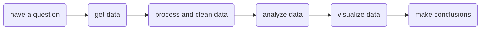

Use the **DO FILE EDITOR** to save Stata commands that you want to use again in a `.do` file, and to create an *audit trail* of your work so that your workflow is *documented* and *replicable.* 

Click on `my_penguins.do` to see an example `.do` file that creates such an *audit trail*.

So many projects have the same, or similar, workflow.

