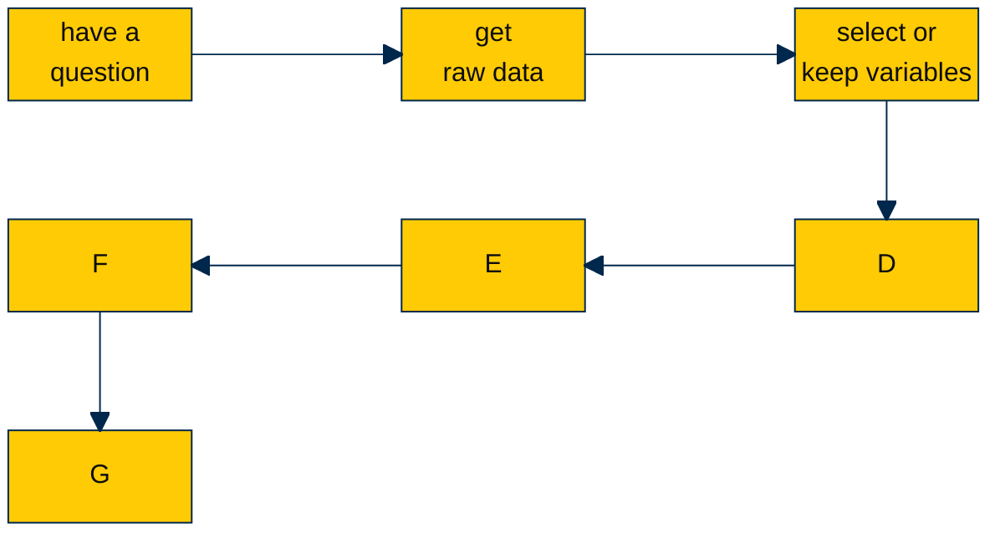

So many projects have the same, or similar, workflow.

Use the **DO FILE EDITOR** to save Stata commands that you want to use again in a `.do` file, and to create an *audit trail* of your work so that your workflow is *documented* and *replicable.* **DO YOUR THINKING IN CODE!!!**

Click on `my_penguins.do` to see an example `.do` file that creates such an *audit trail*.

* [mypenguins.do - raw text](https://github.com/agrogan1/Stata/blob/main/do-files/my_penguins.do)
* [mypenguins.pdf - PDF with colorful syntax](https://agrogan1.github.io/Stata/do-files/my_penguins.pdf)
