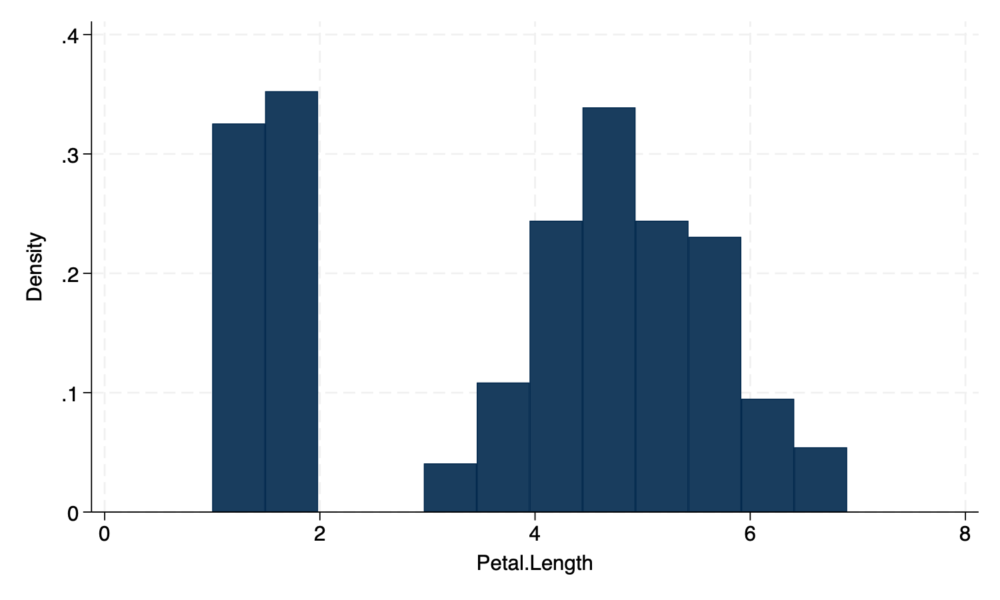
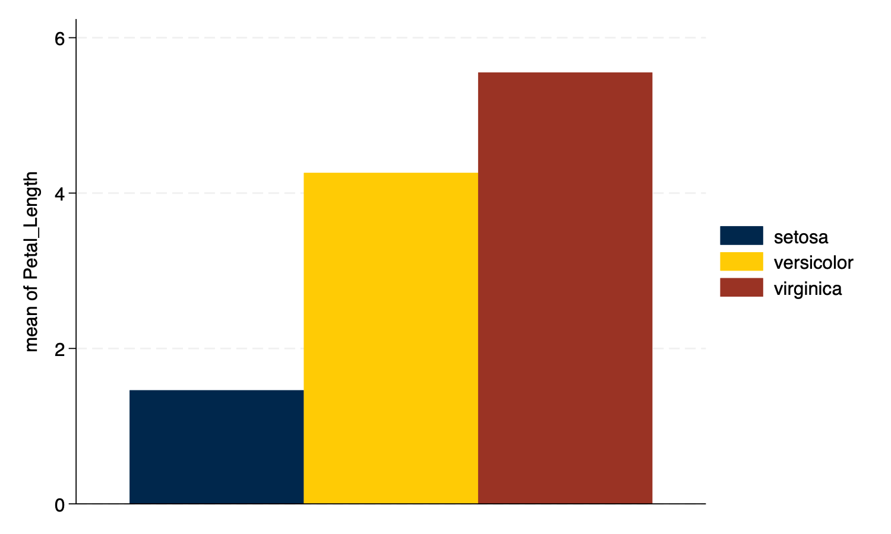
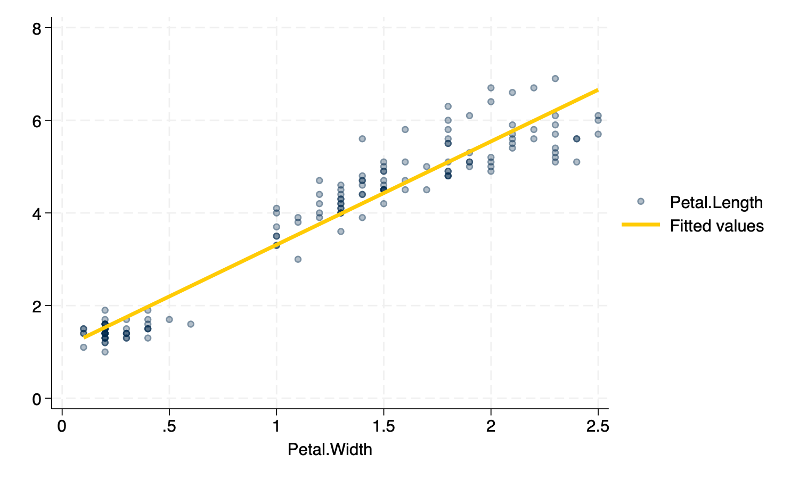

% Installing and Using the Michigan Graph Scheme
% Andy Grogan-Kaylor
% {{.1}} {{.2}}

---
geometry: margin=1 in
---

# Introduction

{{3}}

{width=75%}

Stata provides the use of graph schemes that improve the overall look of graphs.

See `help scheme`.

The *Michigan graph scheme* makes use of official University of Michigan colors.

# Installation

Use of the *Michigan graph scheme* depends on installation of the `lean2` graph scheme developed by Svend Juul.

Type `findit lean2` and click through on the install links to install `lean2`.
      
Then type `net from https://agrogan1.github.io/Stata` and click the links to install.

# Example Data

We are going to use the famous "iris" data collected by Edgar Anderson.

{{4}}

# Histogram

{{5}}

{{6}}

    
{width=50%}

# Histogram With Transparency

{{7}}

{{8}}

    
{width=50%}

# Bar Graph

{{9}}

{{10}}

    
{width=50%}

# Bar Graph With Transparency

{{11}}

{{12}}

    
{width=50%}

# Scatterplot

{{13}}

{{14}}

    
{width=50%}

# Scatterplot With Transparency

{{15}}

{{16}}

    
{width=50%}

# Legend Placement

Sometimes you may wish to have the legend of the graph placed at the *bottom* of the graph. The `pos(6)` suboption inside the `legend` option will place the legend at the bottom, while you can manually control the number of legend rows with the `rows` suboption.

{{17}}

{{18}}

    
{width=50%}

# Individual Michigan Colors

Individual University of Michigan colors are listed below. 

-------------------------------------------------------------
Color                Hex        RGB
-------------------- ---------- ----------
Blue                 #00274C    0 39 76

Maize                #FFCB05    255 203 5

Tappan Red           #9A3324    154 51 36

Ross School Orange   #D86018    216 96 24

Wave Field Green     #A5A508    165 165 8

Taubman Teal         #00B2A9    0 178 169

Arboretum Blue       #2F65A7    47 101 167

Ann Arbor Amethyst   #702082    112 32 130

Matthaei Violet      #575294    87 82 148

Umma Tan             #CFC096    207 192 150

Burton Tower Beige   #9B9A6D    155 154 109

Angell Hall Ash      #989C97    152 156 151

Law Quad Stone       #655A52    101 90 82
-------------------------------------------------------------

Stata can use RGB codes for colors. As an example.

{{19}}

{{20}}

{width=50%}

\newpage

# Michigan2 Graph Scheme

I have also developed a `michigan2` graph scheme: `, scheme(michigan2)`.

This graph scheme can be installed using the same instructions as above. The `michigan2` scheme slightly reorders the color palette of the original scheme. The scheme begins with blue and maize, but then moves to the *cooler* colors before moving to *Tappan Red* and *Ross Orange*. *Taubman Teal*--a very fluorescent color--is moved to the end of the palette.

{{21}}

{width=50%}

