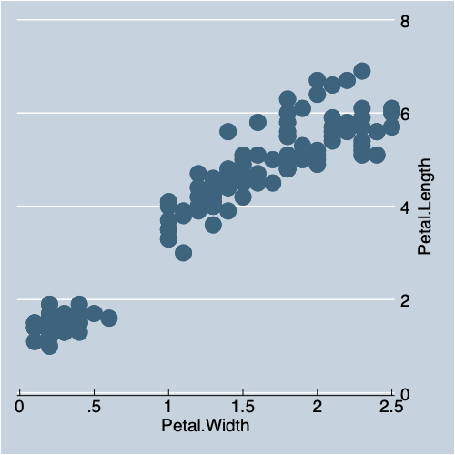

% Data Visualization With Stata
% Andy Grogan-Kaylor
% {{.1}} {{.2}}

---
geometry: margin=1 in
---

# Introduction 

* Stata is a powerful and intuitive data analysis program. 
* Learning how to graph in Stata is an important part of learning how to use Stata. 
Yet, the default graphs in Stata can sometimes be less than optimal. 
* This document is an introduction to (a) basic graphing ideas in Stata;
and (b) some simple ways to make your Stata graphs look more professional.
* If this document is presented as slides, navigation links are in the corner of this slide deck.
* If this document is presented as slides, you can generate a printable version of these slides, by clicking on the "Ø".

# What are Variables?

* By variables, I simply mean the columns of data that you have.
* For our purposes, you may think of variables as synonymous with questionnaire items, or columns of data.

# Variable Types

* *categorical variables* represent unordered categories like *neighborhood*, or *religious affiliation*, or *place of residence*.
* *continuous variables* represent a continuous scale like a *mental health scale*, or a *measure of life expectancy*.

# A Data Visualization Strategy

Once we have discerned the type of variable that have, there are two followup questions we may ask before deciding upon a chart strategy:

* Is our graph about **one thing at a time**?
     + How much of *x* is there? 
     + What is the distribution of *x*?
* Is our graph about **two things at a time**?
     + What is the relationship of *x* and *y*?
     + How are *x* and *y* associated?

# Data

We are going to use the famous "iris" data collected by Edgar Anderson in the early 20th Century.

{{3}}

> The `iris` data set has 5 variables.

# Species of Iris

> Iris species images courtesy [Wikipedia](https://www.wikipedia.org/).

# Petals and Sepals

# Basic Graphs

# Continuous Variable `histogram`

{{4}}

{{5}}

    

    
# Categorical Variable `graph bar`

{{6}}

{{7}}

# Continuous by Continuous `twoway`

{{8}}

{{9}}

    

# Categorical by Categorical `graph bar`

{{10}}

{{11}}

# Continuous by Categorical `graph bar`

{{12}}

{{13}}

    

# Titles and Labels `, title(...) xtitle(...) ytitle(...)`

{{14}}

{{15}}

# Better Graphing With Schemes `,scheme(...)`

The easiest method to make better Stata graphs is through the use of predefined Stata 
graphing schemes.

# Pre-Defined Schemes

Some schemes, e.g. `economist`, `sj`, `s1color`, and `s1rcolor` are pre-installed with Stata.

# Economist Scheme

{{16}}

{{17}}

    
    

# *Stata Journal* Scheme

{{18}}

{{19}}

    
    

# `s1color` Scheme

{{20}}

{{21}}

    
    

# `s1rcolor` Scheme

{{22}}

{{23}}

    
    

# User Written Schemes

Two of the best user written schemes are `plottig` and `lean2`. 

Use the `findit` command e.g. `findit lean2` to find these schemes.

# `lean2` Scheme

{{24}}

{{25}}

    

# Michigan graph scheme    

I have written a `michigan` graph scheme 
described [here](https://agrogan1.github.io/Stata/).

{{26}}

{{27}}

    
    

# Schemes as a Base for Further Tweaking

Schemes can be used as a base that can then be further modified.

{{28}}

{{29}}

    
    

# Even More Tweaks

Based upon an example at 
[https://blog.stata.com/2018/10/02/scheming-your-way-to-your-favorite-graph-style/](https://blog.stata.com/2018/10/02/scheming-your-way-to-your-favorite-graph-style/)

{{30}}

{{31}}

    

    
# More Information

See also [Two Page Stata](https://agrogan1.github.io/Stata/two-page-stata/TwoPageStata.pdf)

Created by [agrogan@umich.edu](agrogan@umich.edu)

